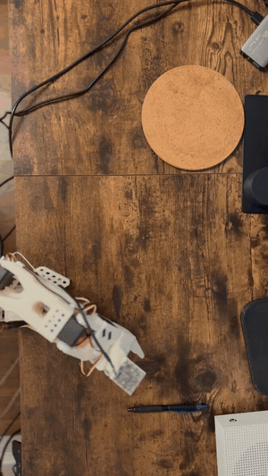

<h1 align="center">Language-Controlled Robotic Arm</h1>

<p align="center">
  <em>Say the name of an object, and a low-cost robotic arm finds it, grasps it the way that
  object needs, and places it. Built on a self-assembled SO-101 arm and a fine-tuned
  vision-language-action foundation model, running in real time on a laptop.</em>
</p>

<!-- HERO: drop your showcase video here. In GitHub's web editor you can drag-and-drop
     the mp4 directly onto this line and it becomes an inline player. -->
<p align="center">
  <!--  -->
  <b>▶ Showcase video: [add link once hosted]</b>
</p>

<p align="center">
  <a href="https://huggingface.co/jayantrathi/smolvla_lang_grasp_v1">Model</a> ·
  <a href="https://huggingface.co/datasets/jayantrathi/lang_grasp_v1">Dataset</a> ·
  <a href="#reproduce-the-full-pipeline">Reproduce</a>
</p>

---

## What it does

Given a spoken or typed command such as *"pick up the pen and drop it on the plate,"* the arm
locates the named object, grasps it with a grip appropriate to that object (a pinch for a pen, a
squeeze for a plush toy), and places it on a target zone. It works across multiple objects and
generalizes to arbitrary object positions in the workspace, not a single fixed spot. All inference
runs on-device on an Apple Silicon laptop; training was done on a rented cloud GPU.

**Highlights**
- Language-conditioned grasping: the instruction selects both the object and the grasp style.
- Position generalization: the object can start anywhere the camera can see it.
- Real-time, on-device inference from a fine-tuned 450M-parameter VLA.
- Voice control via Whisper (`voice_grasp.py`).
- Fully reproducible pipeline; dataset and model published to the Hugging Face Hub.

---

## The journey

This project was built up one capability at a time. Each stage was proven before the next was
added, which is the through-line of the whole build.

### 1. From reinforcement learning in simulation to imitation learning on real hardware
It started as a reinforcement-learning project in simulation (MuJoCo / Gymnasium). RL turned out to
be sample-inefficient and slow to converge on this task, which motivated the switch to **imitation
learning on real hardware**: instead of millions of trial-and-error steps, the policy learns from a
modest number of human demonstrations. That pivot is the foundation of everything below.

### 2. Building the arm and first teleoperation
A self-assembled **SO-101** (SO-ARM101) arm with Feetech serial-bus servos, driven by a second
"leader" arm in leader-follower teleoperation.

<!--  -->
> _media: earliest arm movement / leader-follower teleop_

### 3. VR teleoperation
Teleoperating the arm from a Meta Quest headset over WebXR, as an alternative demonstration
interface. (This included debugging and patching a bug in a community teleop repo.)

<!--  -->
> _media: Quest driving the real arm_

### 4. Collecting demonstrations
Recording teleoperated pick-and-place demonstrations with a wrist-mounted camera, each labeled with
a natural-language instruction. Data strategy was **breadth over depth**: a spread across objects
and positions rather than hundreds of demos of one object, so the model's pretraining fills the gaps.

<!--  -->
> _media: leader-follower recording a demonstration_

### 5. Training
First an **ACT** (Action Chunking Transformer) policy from scratch to validate the pipeline, then a
fine-tuned **SmolVLA** vision-language-action model for the language-conditioned version. Training
ran on a rented A100.

<!--  -->
> _media: training loss / RunPod timelapse_

### 6. The policy running
The trained policy driving the arm autonomously from a command, shown alongside the robot's own
camera view.

<!--  -->
> _media: autonomous run, external view + robot's-eye view_

---

## System

- **Hardware:** self-assembled SO-101 arm, Feetech STS3215 serial-bus servos, wrist-mounted
  (eye-in-hand) USB camera.
- **Software:** Hugging Face LeRobot for recording, training, and deployment.
- **Policy:** SmolVLA, a ~450M-parameter vision-language-action model, fine-tuned from
  `smolvla_base`. Inputs: camera image, joint state, and language instruction. Output: a chunk of
  future actions.

## Method

- **Data:** ~90 teleoperated demonstrations across three objects (plush bear, pen, tube), each
  episode labeled with its instruction, objects placed at varied positions.
- **Training:** fine-tuned `smolvla_base` for 20k steps on a single A100 (~4 hours); model pushed
  to the Hub.
- **Deployment:** real-time on the laptop GPU using LeRobot's real-time chunking (RTC) inference.

## Results

- Reliable language-conditioned pick-and-place for the trained objects, with object-appropriate
  grasps.
- Position generalization across the camera's field of view.
- Real-time autonomous execution on-device, from typed or spoken commands.

## Known limitations (honest)

- **Multi-object selection is not solved yet.** Reliable with one object in the scene; with two
  objects present it becomes indecisive, because it was trained only on single-object scenes and
  never had to use the instruction to disambiguate. This is the next milestone (see roadmap).
- **Low-friction objects** can slip from the gripper. The reach and approach are correct; this is a
  gripper-friction limit, addressable with friction pads.
- **Single eye-in-hand camera** loses sight of the object during the final descent, which limits
  precision at the edges of the workspace.

## Repository contents

```
README.md                 this file
requirements.txt          Python dependencies
voice_grasp.py            voice control (mic -> Whisper -> policy)
scripts/record.sh         record leader-follower demonstrations
scripts/train_smolvla.sh  fine-tune SmolVLA on a GPU
scripts/deploy.sh         run the policy on the arm for a typed command
media/                    GIFs and clips used in this README
```

The trained model and dataset live on the Hugging Face Hub (linked above), not in this repo, since
they are large artifacts rather than source.

## Reproduce the full pipeline

```bash
pip install -r requirements.txt

# 1. Record demonstrations (one object per batch; repeat with --resume + a new label)
./scripts/record.sh "Pick up the pen and drop it on the plate" 30
./scripts/record.sh "Pick up the bear and drop it on the plate" 30 --resume
./scripts/record.sh "Pick up the lip balm and drop it on the plate" 30 --resume

# 2. Fine-tune SmolVLA on a GPU (auto-pushes the model to the Hub)
./scripts/train_smolvla.sh

# 3. Run it on the arm (typed command)
./scripts/deploy.sh "Pick up the pen and drop it on the plate"

# ...or by voice
python voice_grasp.py
```

## Key design decisions

- **Imitation learning, not reinforcement learning** for sample efficiency on real hardware.
- **A pretrained VLA, not a per-object policy**, so new objects need far less data than training
  from scratch.
- **Single-mode first, then generalize**: one object at one position, then position generalization,
  then multiple objects with language labels.

## Roadmap

1. **Multi-object selection** via a zero-shot open-vocabulary detector, so selection generalizes to
   new objects without retraining the grasp.
2. **Off-frame search**: turn to find an object outside the current camera view.
3. **Re-acquisition**: keep tracking the object if it is moved mid-grasp.
4. **Hand handoff**: place the object into a detected human hand instead of a fixed zone.
5. Grasp refinement (gripper friction pads, more object variety).

---

## Adding the media

Two ways to add the clips referenced above:
1. **GIFs** — put a short GIF in the `media/` folder and uncomment the matching ``
   line. GIFs render inline on GitHub automatically.
2. **Videos** — open this README in GitHub's web editor and drag-and-drop an mp4 onto the spot; GitHub
   hosts it and renders an inline player.
